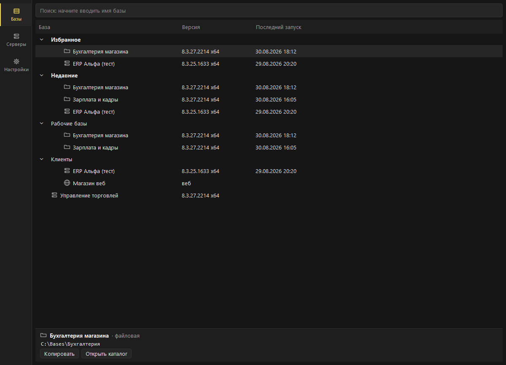

# OneCStarter

[](https://github.com/AnanyevAl/OnecStarter/actions/workflows/ci.yml)

> Fast launcher for 1C:Enterprise infobases on Windows: tree, search,
> explicit platform version control. Russian UI; docs below are in Russian.

Программа запуска информационных баз 1С:Предприятие для специалистов:
дерево групп, мгновенный поиск, избранное, история, явный контроль версии
платформы, ярлыки на базы, drag&drop каталога файловой базы.



## Чем лучше штатного стартера

| # | Штатный стартер | OneCStarter |
| --- | --- | --- |
| А | Версия платформы неуправляема: несоответствие видно только после падения | Колонка версии у каждой базы, подсветка не установленных версий, явный выбор при запуске |
| Б | Плоский список не масштабируется: нет поиска, избранного, истории | Дерево групп, мгновенный поиск, избранное, история запусков, трей и глобальный хоткей |
| Г | Добавление базы — ручное заполнение полей | Drag&drop каталога файловой базы в окно, автозаполнение полей |
| Д | Знает только «свои» версии платформы; выход новой требует обновления стартера | Знание о версиях платформы — данные, не код |

Подробности и способ измерения каждого пункта — [docs/requirements.md](docs/requirements.md), §2.

## Установка

- **Установщик:** `OneCStarter-2.0.0-setup.exe` — per-user, права
  администратора не нужны.
- **Portable:** распаковать `OneCStarter-2.0.0-portable.zip`, запустить
  `OneCStarter.exe`.

SmartScreen при первом запуске предупредит о неизвестном издателе:
сборки не подписаны (сертификата нет). Исходники открыты — сборку можно
воспроизвести самостоятельно (см. ниже).

## Совместимость со штатным стартером

`ibases.v8i` — источник правды; после любой операции файл остаётся рабочим
для 1CEStart. Удаление OneCStarter ничего не теряет.

## Диагностика

Лог: `%APPDATA%\OneCStarter\logs\onecstarter.log`. Если приложение
не стартует — запустите `OneCStarterc.exe` (консольная сборка) и приложите
вывод к issue.

## Сборка из исходников

```powershell
uv sync
uv run pytest
powershell -File build/build.ps1
```

Установщик требует Inno Setup 6. Без него — сборка только portable-варианта:
`powershell -File build/build.ps1 -SkipInstaller`.

Устройство исходников и правила для изменений — [CONTRIBUTING.md](CONTRIBUTING.md).

## Границы

1С:Предприятие 7.7 не поддерживается; телеметрии нет; пароли
не сохраняются. Подробнее: [docs/requirements.md](docs/requirements.md).

## Лицензия

MIT.
