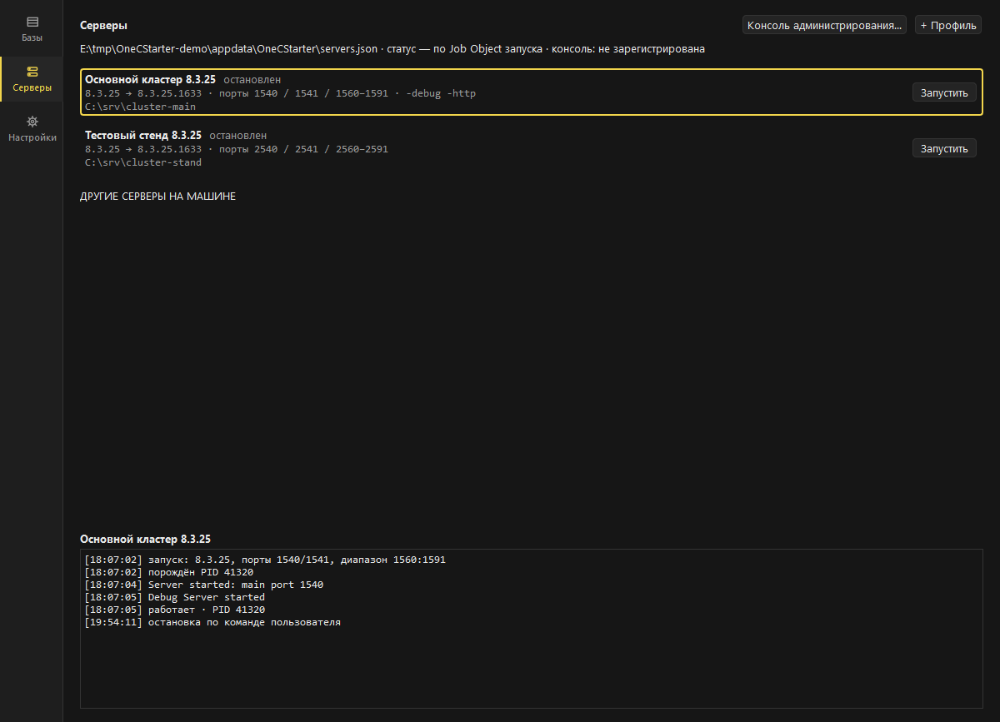

# OneCStarter

[](https://github.com/AnanyevAl/OnecStarter/actions/workflows/ci.yml)

> Fast launcher for 1C:Enterprise infobases on Windows: tree, search,
> explicit platform version control, local 1C server management.
> Russian UI; docs below are in Russian.

Программа запуска информационных баз 1С:Предприятие для специалистов:
дерево групп, мгновенный поиск, избранное, история, явный контроль версии
платформы, ярлыки на базы, drag&drop каталога файловой базы, порядок
списка по алфавиту или как в файле, сворачивание в трей при запуске,
логин и пароль для входа — и раздел «Серверы» для локальных серверов 1С.
Базы, опубликованные на веб-сервере, открываются тонким клиентом
или в браузере — по выбору.


## Чем лучше штатного стартера

| # | Штатный стартер | OneCStarter |
| --- | --- | --- |
| А | Версия платформы неуправляема: несоответствие видно только после падения | Колонка версии у каждой базы, подсветка не установленных версий, явный выбор при запуске |
| Б | Плоский список не масштабируется: нет поиска, избранного, истории | Дерево групп, мгновенный поиск, избранное, история запусков, трей и глобальный хоткей |
| Г | Добавление базы — ручное заполнение полей | Drag&drop каталога файловой базы в окно, автозаполнение полей |
| Д | Знает только «свои» версии платформы; выход новой требует обновления стартера | Знание о версиях платформы — данные, не код |

Подробности и способ измерения каждого пункта — [docs/requirements.md](docs/requirements.md), §2.

## Раздел «Серверы» (v2)

Локальные серверы 1С для разработки — из того же окна: профиль сервера
(версия `ragent`, порты, каталог кластера, `-debug`/`-http`), запуск
и остановка всего дерева одним действием, журнал профиля с событиями
и выводом сервера, смена версии консоли администрирования. Чужие серверы
на машине и держатели портов профиля видны и подсвечены — запуск в занятый
порт отказывает словами, а не падением. Дерево сервера живёт в Job Object
запуска: выход из лаунчера не оставляет процессов-сирот (при работающих
серверах выход спрашивает подтверждение).



## Веб-базы: тонкий клиент или браузер (v2.3)

Базу, опубликованную на веб-сервере (`Connect=ws=…`), открывает тонкий клиент
или браузер — решает ключ `App` в свойствах записи, а для записей без него —
настройка «Веб-базы открывать». Разовый выбор есть в контекстном меню:
«Тонкий клиент» и «Открыть в браузере». Ключ `App` читает и штатный стартер,
поэтому выбор переживает нашу программу.

Версию платформы для веб- и клиент-серверных баз выбирает **сервер** —
публикация или кластер, — а не ключ `Version` из списка. Мы её не навязываем:
колонка версии у таких баз показывает «веб» или «сервер» и подсказку, кто
решает. Попытка навязать свою версию оборачивалась зависанием клиента
на «Загрузка конфигурационной информации…» без единого сообщения — это
исправлено.

## Логин и пароль (v2.2)

Логин хранится в наших данных, пароль — в диспетчере учётных данных Windows
(DPAPI). Функция включается для конкретной записи и выключена по умолчанию.

Учтите цену: у GUI-клиента 1С нет входа через stdin, поэтому пароль передаётся
в командной строке (`/P`) и **виден любой программе, работающей под вашей
учётной записью, всё время работы клиента**. Обойти это нельзя — можно только
не включать функцию. Программа предупреждает об этом при сохранении пароля.

## Установка

- **Установщик:** `OneCStarter-2.3.0-setup.exe` — per-user, права
  администратора не нужны.
- **Portable:** распаковать `OneCStarter-2.3.0-portable.zip`, запустить
  `OneCStarter.exe`.

SmartScreen при первом запуске предупредит о неизвестном издателе:
сборки не подписаны (сертификата нет). Исходники открыты — сборку можно
воспроизвести самостоятельно (см. ниже).

## Совместимость со штатным стартером

`ibases.v8i` — источник правды; после любой операции файл остаётся рабочим
для 1CEStart. Удаление OneCStarter ничего не теряет.

## Диагностика

Лог: `%APPDATA%\OneCStarter\logs\onecstarter.log`. Если приложение
не стартует — запустите `OneCStarterc.exe` (консольная сборка) и приложите
вывод к issue.

## Сборка из исходников

```powershell
uv sync
uv run pytest
powershell -File build/build.ps1
```

Установщик требует Inno Setup 6. Без него — сборка только portable-варианта:
`powershell -File build/build.ps1 -SkipInstaller`.

Устройство исходников и правила для изменений — [CONTRIBUTING.md](CONTRIBUTING.md).

## Границы

1С:Предприятие 7.7 не поддерживается; телеметрии и любого сбора данных нет.
Пароль сохраняется только если вы это включили для конкретной записи, и только
в диспетчере учётных данных Windows — свои файлы программы секретов не хранят
(см. «Логин и пароль» выше). Подробнее:
[docs/requirements.md](docs/requirements.md).

## Лицензия

MIT.
