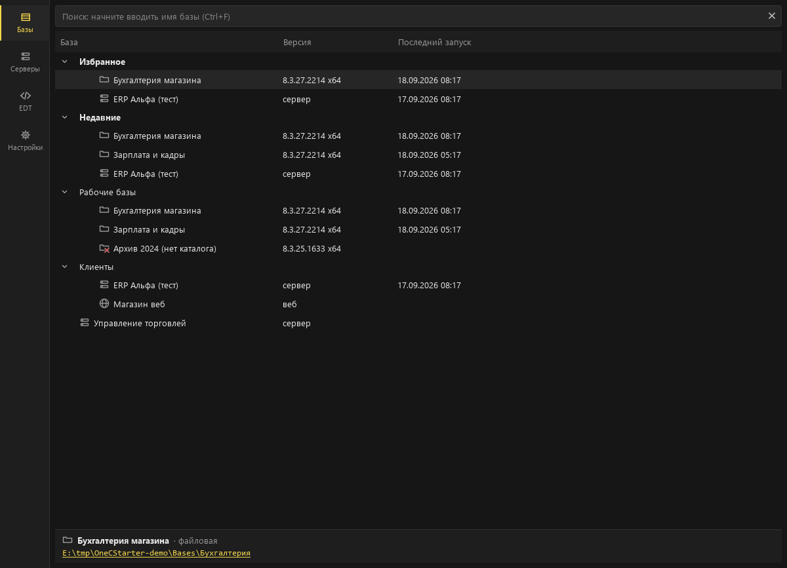
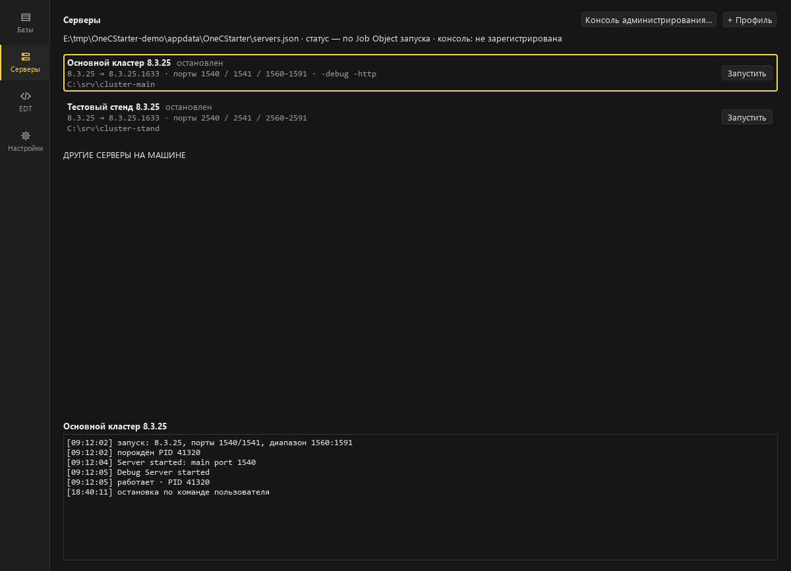
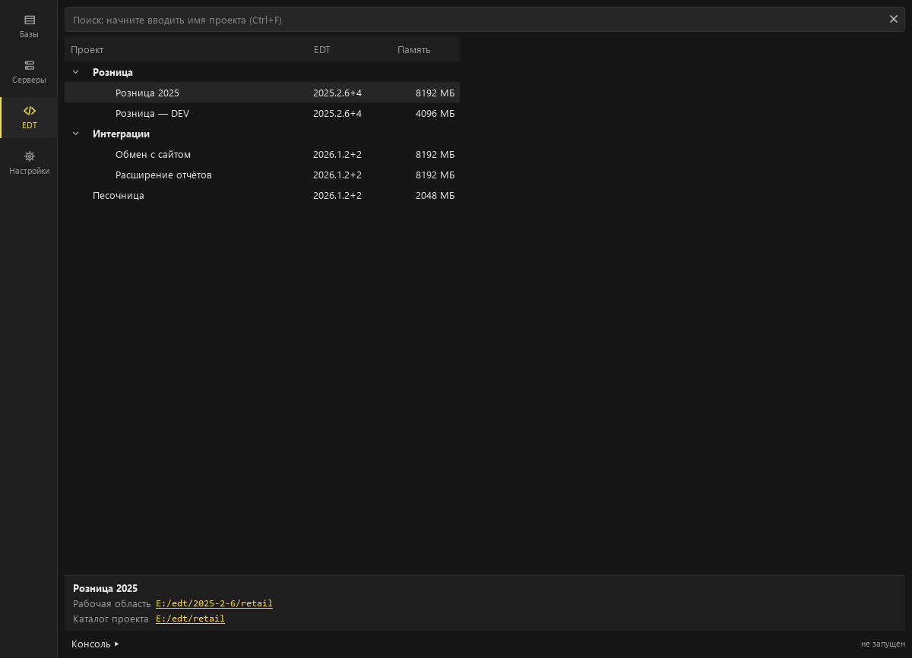

# OneCStarter

[](https://github.com/AnanyevAl/OnecStarter/actions/workflows/ci.yml)

> Fast launcher for 1C:Enterprise infobases on Windows: tree, search,
> explicit platform version control, local 1C server management,
> 1C:EDT workspaces with CLI import. Russian UI; docs below are in Russian.

Программа запуска информационных баз 1С:Предприятие для специалистов.
Три раздела в одном окне: «Базы» — список баз с явным контролем версии
платформы, «Серверы» — локальные серверы 1С для разработки, «EDT» — рабочие
области 1C:EDT с запуском нужной версии и командами `1cedtcli.exe`.
Переход между разделами — `Alt+1`…`Alt+N` по их порядку в левой панели.
Список баз — тот же `ibases.v8i`, что у штатного стартера: после любой
операции файл остаётся рабочим для 1CEStart, удаление OneCStarter ничего
не теряет.



## Базы

- **Дерево и поиск.** Группы как в файле, «Избранное» и «Недавние» сверху,
  порядок — по алфавиту или как в файле. Поиск по имени (`Ctrl+F`, крестик
  очистки); `Enter` в поиске запускает первую найденную.
- **Версия платформы.** Колонка версии у каждой базы, не установленные версии
  подсвечены, при запуске версия выбирается явно. У веб- и клиент-серверных баз
  версию решает сервер — колонка так и говорит («веб», «сервер»), своя версия
  не навязывается. Знание о версиях платформы — данные, не код: выход новой
  версии не требует обновления программы.
- **Запуск.** `Enter`/`F3` — 1С:Предприятие, `F4` — конфигуратор, `Ctrl+1/2/3` —
  тонкий, толстый клиент, конфигуратор; ярлыки на базы; сворачивание в трей при
  запуске; глобальная горячая клавиша для окна.
- **Веб-базы.** Базу, опубликованную на веб-сервере, открывает тонкий клиент
  или браузер — решает ключ `App` записи (его читает и штатный стартер), для
  записей без него — настройка «Веб-базы открывать». Разовый выбор — в
  контекстном меню.
- **Логин и пароль.** Включается для конкретной записи. Логин — в наших данных,
  пароль — в диспетчере учётных данных Windows (DPAPI). Цена: у GUI-клиента 1С
  нет входа через stdin, пароль передаётся в командной строке (`/P`) и **виден
  любой программе под вашей учётной записью всё время работы клиента** —
  программа предупреждает об этом при сохранении.
- **Доступность файловых баз.** Каталог, исчезнувший с диска (съёмный носитель,
  сетевая шара), виден до запуска: крестик на значке и «(нет каталога)» в строке.
  Проверка идёт в фоне при старте и по `F5`, без таймера — чтобы не будить
  внешние диски и VPN.
- **Правка списка.** Drag&drop каталога файловой базы в окно с автозаполнением
  полей; `Alt+Enter` — свойства записи или группы, `Insert` — новая база в группу
  текущей строки, `Delete` — удалить (с подтверждением), `Alt+↑/↓` — переставить.
  Путь в панели снизу — ссылка: клик открывает каталог, правая кнопка —
  «Копировать». Справочник всех сочетаний — в настройках.

## Серверы

Локальные серверы 1С для разработки — из того же окна: профиль сервера
(версия `ragent`, порты, каталог кластера, `-debug`/`-http`), запуск
и остановка всего дерева одним действием, журнал профиля с событиями
и выводом сервера, смена версии консоли администрирования. Чужие серверы
на машине и держатели портов профиля видны и подсвечены — запуск в занятый
порт отказывает словами, а не падением. Дерево сервера живёт в Job Object
запуска: выход из лаунчера не оставляет процессов-сирот (при работающих
серверах выход спрашивает подтверждение).



## EDT



**Записи.** Список рабочих областей 1C:EDT с группами. У записи — версия EDT
(точное совпадение с установленной), JVM, память (действующий `-Xmx` — в колонке
«Память») и язык. «Открыть в EDT» запускает нужную версию с правильной JVM,
повторный запуск переключает на открытое окно (зелёный ▶ у имени — EDT запущен).
«Открыть в VS Code» / «Открыть в Antigravity» открывают каталог проекта (может
лежать вне рабочей области). Записи можно импортировать из EDT Start — вручную,
только новые; реестр EDT Start только читается, список хранится в
`%APPDATA%\OneCStarter\edt.json`.

**Установки вне стандартного каталога.** Если нужной версии нет среди найденных
стандартным способом, в Настройках → EDT задайте «Каталог установок EDT».
Подойдёт как каталог, где лежат несколько установок (`installations`), так и
каталог одной конкретной установки — тот, где `1cedt.exe`. Подпись под полем
сразу показывает, сколько установок нашлось.

**CLI.** Подменю «CLI» — сборка, импорт, проверка и информация по проектам через
`1cedtcli.exe` с выводом в сворачиваемую консоль; работает только на рабочей
области, не открытой в EDT (иначе CLI вернёт код 202). Перечень проектов для
проверки берётся из реестра рабочей области (`.metadata`), а не из подкаталогов —
проекты EDT обычно лежат снаружи.

### Импорт проектов

Типичный случай: новая пустая рабочая область и клон репозитория, в котором
лежат десятки проектов (`src/<имя>/.project` — конфигурация и расширения).
В самой EDT для этого есть мастер импорта, но он требует открыть EDT и пройти
мастер руками; здесь то же делается из списка, без запуска EDT.

1. Заведите запись: рабочая область — новый (можно пустой) каталог, каталог
   проекта — корень клона. EDT на этой области должен быть закрыт: CLI работает
   только с областью, не открытой в EDT (иначе код 202).
2. Контекстное меню записи → «CLI» → «Импортировать проекты…». В диалоге уже
   подставлен каталог проекта записи; программа находит в нём проекты так же,
   как мастер EDT — каталоги с файлом `.project`, до трёх уровней вглубь
   (для клона это `src/<имя>`) — и показывает их списком с флажками. Каталог
   можно сменить кнопкой «Обзор…» или набрать и нажать `Enter` — список
   пересканируется.
3. Проекты, уже привязанные к этой рабочей области, помечены «— уже в рабочей
   области» и недоступны: повторный импорт занял бы столько же времени и ничего
   бы не изменил. Строка под списком показывает, сколько найдено и сколько из них
   привязано; «Выбрать всё» / «Снять всё» действуют на доступные.
4. «ОК» — отмеченные импортируются **одним сеансом CLI**: команды `import`
   записываются в скрипт, и `1cedtcli.exe` выполняет его в режиме `-file`
   (JDK записи передаётся через свой ini-файл — иначе обёртка CLI его теряет).
   Каждый запуск CLI поднимает headless-Eclipse, около 48 секунд; на скрипт это
   тратится один раз — два проекта импортируются примерно за минуту, а не за две.
   Ход виден в консоли внизу раздела: «Импортировать (проектов: N)», по завершении —
   код. Скрипт и ini лежат рядом с журналом записи в `%APPDATA%\OneCStarter\logs\edt`.
5. Код 0 — все привязаны; при следующем открытии диалога они будут помечены как
   привязанные, а в EDT появятся под именами из своих `.project`. Код 204 — скрипт
   остановился на первой неудавшейся команде (например, каталог без `.project`):
   текст ошибки — в журнале (кнопка «Открыть журнал» в консоли), уже привязанные до неё
   остаются, остальное можно импортировать повторно — привязанные в списке
   отфильтруются сами.

Второй вариант того же диалога — «Файлы конфигурации XML»: каталог выгрузки
конфигурации в XML, каталог или имя нового проекта, базовый проект (для расширений
и внешних обработок), версия платформы и флажок «Собрать после импорта (--build)».
Это одна команда `import --configuration-files`, без списка.

Порядок в списке значения не имеет: расширение импортируется и без своей
конфигурации в рабочей области (ошибки валидации в этом случае покажет EDT,
а не CLI).

### Цветовая схема

Цвета редактора кода EDT живут в настройках рабочей области (два файла в
`.metadata\.plugins\org.eclipse.core.runtime\.settings`), и в самой EDT их приходится
задавать по одному. Контекстное меню записи → «Цветовая схема…» открывает диалог:
слева — источники (текущие цвета рабочей области, умолчания EDT и схемы из каталога,
заданного в Настройках → EDT: темы IntelliJ IDEA `.xml`/`.icls`/`.jar`, TextMate
`.tmTheme`, файлы `.csi`), справа — предпросмотр фрагмента кода 1С и таблица из
22 цветов, каждый правится кликом по образцу или кодом `#RRGGBB`. «Инвертировать»
переворачивает схему, «Сохранить в файл…» пишет её в `.csi` в каталог схем.
«Применить» записывает цвета в рабочую область сразу — EDT на ней должна быть закрыта
(при выходе EDT может переписать свои настройки из памяти); изменения видны после
следующего запуска. Запись ничего не запоминает: истина — в рабочей области.
«По умолчанию EDT» без правок снимает наши ключи, и EDT возвращает свои умолчания.
Чужие ключи в файлах настроек сохраняются, запись атомарная. Переключатель «Тема
окна» пишет `themeid` тёмной или светлой темы Eclipse; «не трогать» оставляет как есть.

**Клавиши.** `Enter` — открыть в EDT, `Alt+Enter` — изменить запись или группу,
`Insert` — добавить запись в группу текущей строки, `Delete` — удалить, `F5` —
обновить установки и состояние.

## Настройки

Тема (тёмная, светлая, как в системе), глобальная горячая клавиша окна,
поведение трея и автозапуск, клиент по умолчанию и веб-базы, размер истории,
корень каталогов серверов, JVM и редакторы для EDT, каталог установок EDT,
каталог цветовых схем, справочник сочетаний разделов «Базы» и «EDT» и общих сочетаний окна,
версия программы и ссылка на репозиторий.
Настройки применяются сразу и хранятся в `%APPDATA%\OneCStarter\settings.json`.

## Установка

Последний выпуск — на странице
[Releases](https://github.com/AnanyevAl/OnecStarter/releases/latest):

- **Установщик:** `OneCStarter-<версия>-setup.exe` — per-user, права
  администратора не нужны.
- **Portable:** распаковать `OneCStarter-<версия>-portable.zip`, запустить
  `OneCStarter.exe`.

SmartScreen при первом запуске предупредит о неизвестном издателе:
сборки не подписаны (сертификата нет). Исходники открыты — сборку можно
воспроизвести самостоятельно (см. ниже). Настройки и списки хранятся
в `%APPDATA%\OneCStarter` и при обновлении сохраняются.

## Диагностика

Лог: `%APPDATA%\OneCStarter\logs\onecstarter.log`. Первая строка каждого
запуска — версия программы и разрядность процесса. Если приложение
не стартует — запустите `OneCStarterc.exe` (консольная сборка) и приложите
вывод к issue.

### Замеры производительности

Если программа работает медленно, включите perf-режим — он пишет
длительности операций в отдельный файл
`%APPDATA%\OneCStarter\logs\perf.log`:

```powershell
$env:ONECSTARTER_PERF = "1"
.\OneCStarter.exe
```

В лог попадают длительность скана процессов с их числом, пересборка списка
баз, паузы главного потока дольше 150 мс и события дерева баз дольше 100 мс.
Ни путей к базам, ни имён баз, ни командных строк в этом файле нет —
только счётчики и миллисекунды, файл можно приложить к issue целиком.

Режим выключен по умолчанию; чтобы выключить его в текущем окне PowerShell,
уберите переменную: `Remove-Item Env:ONECSTARTER_PERF`.

## Сборка из исходников

```powershell
uv sync
uv run pytest
powershell -File build/build.ps1
```

Установщик требует Inno Setup 6. Без него — сборка только portable-варианта:
`powershell -File build/build.ps1 -SkipInstaller`.

Устройство исходников и правила для изменений — [CONTRIBUTING.md](CONTRIBUTING.md).
Требования и решения по каждой функции — [docs/requirements.md](docs/requirements.md).

## Границы

1С:Предприятие 7.7 не поддерживается; телеметрии и любого сбора данных нет.
Пароль сохраняется только если вы это включили для конкретной записи, и только
в диспетчере учётных данных Windows — свои файлы программы секретов не хранят
(см. «Логин и пароль» выше).

## Лицензия

MIT.
